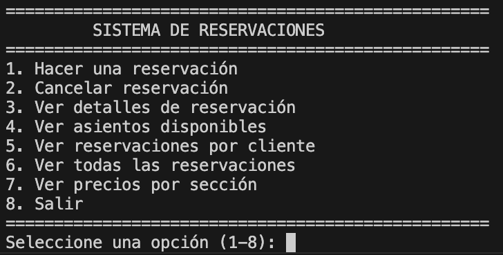
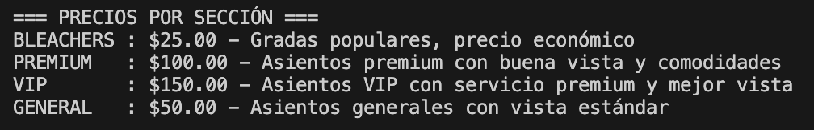
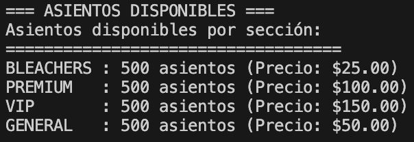
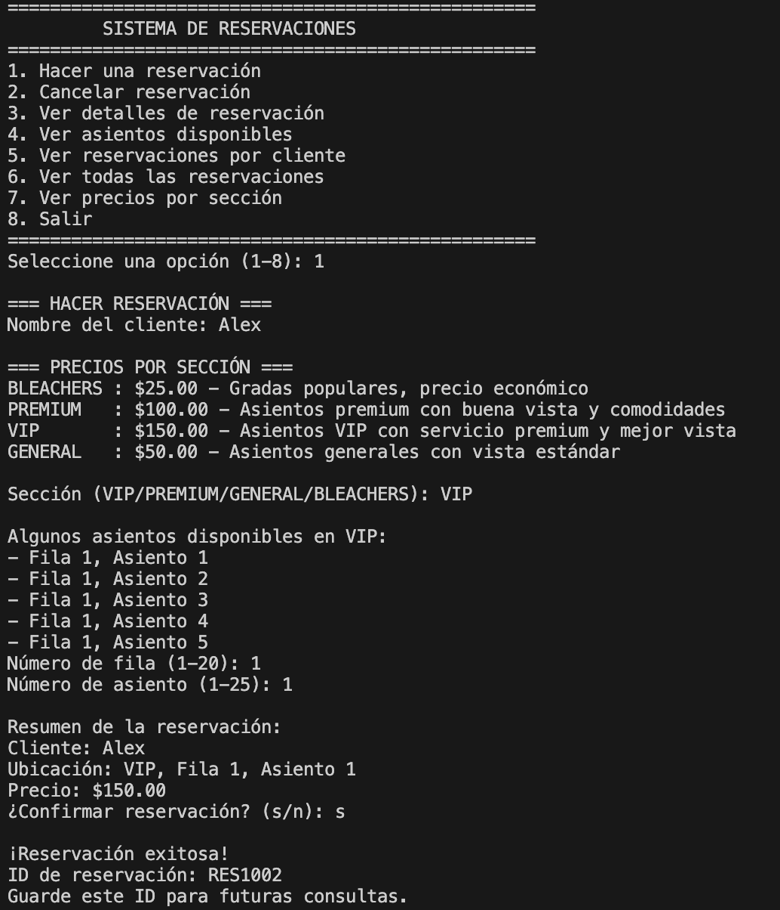

# ⚾ Baseball Stadium Seat Reservation System

A comprehensive Java console application for managing baseball stadium seat reservations with real-time availability tracking, pricing tiers, and customer management.



## 🌟 Features

- **Stadium Management**: 4 sections × 20 rows × 25 seats (2,000 total capacity)
- **Dynamic Pricing**: VIP ($150), Premium ($100), General ($50), Bleachers ($25)
- **Real-time Availability**: Live seat availability tracking
- **Customer Management**: Multi-reservation support per customer
- **Reservation Lifecycle**: Create, view, and cancel reservations
- **Input Validation**: Comprehensive data validation and error handling
- **Bilingual Interface**: Spanish language support



## 🏗️ System Architecture

```
baseball-reservation-system/
├── src/
│   └── main/
│       ├── Main.java              # Application entry point
│       ├── service/
│       │   ├── EstadioService.java     # Stadium & seat management
│       │   └── ReservationManager.java # Reservation operations
│       ├── ui/
│       │   └── ConsoleInterface.java   # User interface
│       └── util/
│           ├── InputValidator.java     # Input validation
│           └── SectionPricing.java     # Pricing management
└── bin/                           # Compiled classes (auto-generated)
```

## 📋 Requirements

- **Java 8 or later**
- No external dependencies required
- Command line or IDE environment

## 🚀 Quick Start

### Option 1: Command Line

1. **Clone/Download** the project files
2. **Navigate** to the project directory:
   ```bash
   cd baseball-reservation-system
   ```
3. **Compile** all Java files:
   ```bash
   javac -d bin -cp src src/main/*.java src/main/service/*.java src/main/ui/*.java src/main/util/*.java
   ```
4. **Run** the application:
   ```bash
   java -cp bin main.Main
   ```

### Option 2: Using an IDE

#### IntelliJ IDEA
1. File → New → Project → Java
2. Create the directory structure as shown above
3. Copy all `.java` files into their respective packages
4. Right-click on `Main.java` → Run 'Main.main()'

#### Eclipse
1. File → New → Java Project
2. Create packages: `main`, `main.service`, `main.ui`, `main.util`
3. Copy files into respective packages
4. Right-click on `Main.java` → Run As → Java Application

#### Visual Studio Code
1. Install Java Extension Pack
2. Create directory structure and copy files
3. Use the command line compilation steps above

## 📖 User Guide

### Main Menu Options



1. **Hacer una reservación** - Make a new reservation
2. **Cancelar reservación** - Cancel existing reservation
3. **Ver detalles de reservación** - View reservation details
4. **Ver asientos disponibles** - Check seat availability
5. **Ver reservaciones por cliente** - View customer's reservations
6. **Ver todas las reservaciones** - View all system reservations
7. **Ver precios por sección** - Display pricing information
8. **Salir** - Exit application

### Making a Reservation



1. Select option `1` from main menu
2. Enter customer name (minimum 2 characters, letters only)
3. Choose section: `VIP`, `PREMIUM`, `GENERAL`, or `BLEACHERS`
4. Select row number (1-20)
5. Select seat number (1-25)
6. Confirm reservation details and price
7. Receive unique reservation ID

### Stadium Layout

| Section   | Price  | Rows | Seats/Row | Total Seats |
|-----------|--------|------|-----------|-------------|
| VIP       | $150   | 20   | 25        | 500         |
| PREMIUM   | $100   | 20   | 25        | 500         |
| GENERAL   | $50    | 20   | 25        | 500         |
| BLEACHERS | $25    | 20   | 25        | 500         |


## 🐛 Troubleshooting

### Common Issues

**Compilation Errors:**
- Ensure all files are in correct directories matching package structure
- Check Java version: `java -version` (requires Java 8+)
- Verify classpath includes all source directories

**Runtime Errors:**
- `ClassNotFoundException`: Check classpath configuration
- Import errors: Verify package declarations match directory structure

**Input/Output Issues:**
- Scanner conflicts: Restart application if input becomes unresponsive
- Character encoding: Ensure terminal supports Spanish characters

### Error Messages Guide

| Error | Cause | Solution |
|-------|-------|----------|
| "Nombre inválido" | Invalid customer name | Use 2+ characters, letters only |
| "Sección inválida" | Wrong section name | Use: VIP, PREMIUM, GENERAL, BLEACHERS |
| "Asiento no disponible" | Seat already reserved | Choose different seat |
| "Reservación no encontrada" | Invalid reservation ID | Check ID format: RES#### |

## 🤝 Contributing

1. Fork the repository
2. Create feature branch: `git checkout -b feature-name`
3. Follow existing code style and package structure
4. Add appropriate input validation for new features
5. Test thoroughly with various input scenarios
6. Submit pull request with clear description

## 📝 License

This project is open source and available under the [MIT License](LICENSE).

## 📞 Support

For questions or issues:
1. Check the troubleshooting section above
2. Verify system requirements and setup
3. Review sample test scenarios
4. Open an issue with detailed error description

---
